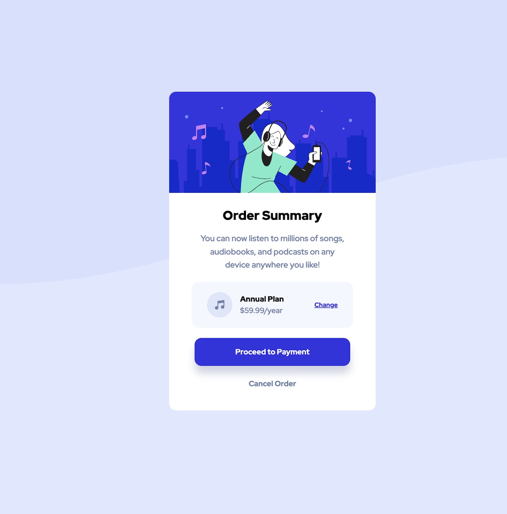
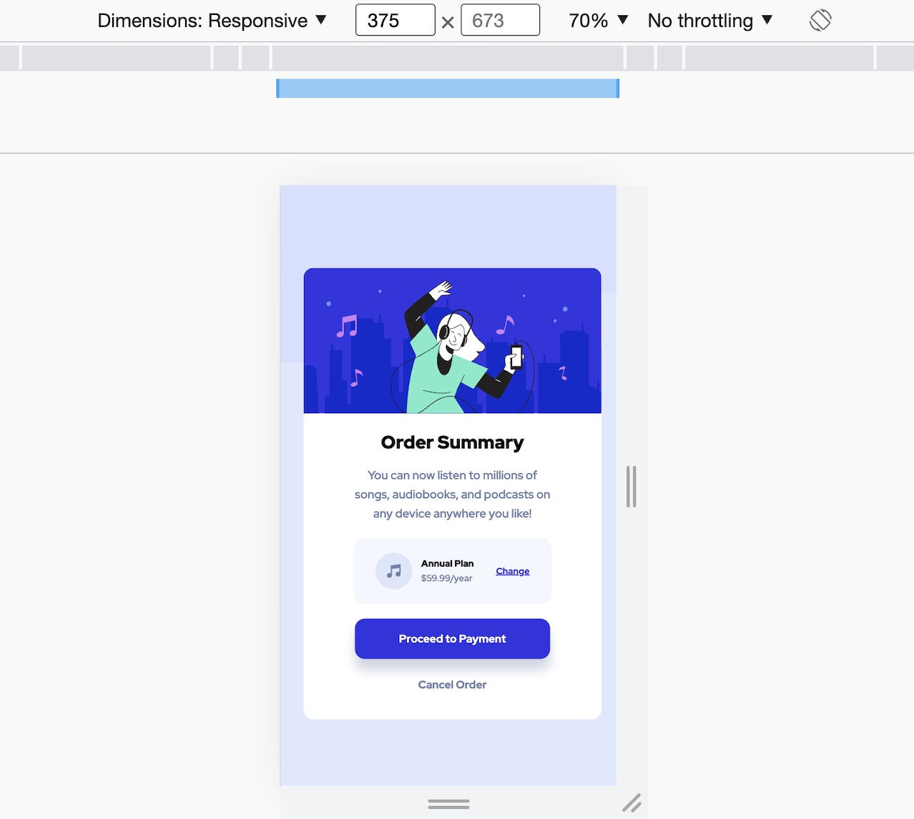

# Order Summary Component

A responsive order-summary card built as a Frontend Mentor practice project.

## Overview

The goal of this project was to reproduce the supplied order-summary design as closely as possible while keeping the layout responsive across desktop and mobile screen sizes.

## Live Demo

[Open Live Site](https://dm-order-summary-component-main.netlify.app/)

## Screenshots

## Built With

- Semantic HTML5
- CSS custom properties
- Flexbox
- CSS Grid
- Mobile-first responsive design

## What I Learned

This project provided practical experience with card layouts, spacing, typography, responsive design, and adapting a supplied interface across different viewport sizes.

## Project Context

This was created as part of my earlier front-end development practice and is retained as a record of that stage of my development progression.

## Resources

- [Frontend Mentor](https://www.frontendmentor.io/)
- [MDN Web Docs](https://developer.mozilla.org/)

## Author

- Frontend Mentor: [@humerous](https://www.frontendmentor.io/profile/Humerous)
- X: [@DavidMillerster](https://www.twitter.com/DavidMillerster)

## License

MIT License

Copyright (c) 2022 David K Miller

Permission is hereby granted, free of charge, to any person obtaining a copy
of this software and associated documentation files (the "Software"), to deal
in the Software without restriction, including without limitation the rights
to use, copy, modify, merge, publish, distribute, sublicense, and/or sell
copies of the Software, and to permit persons to whom the Software is
furnished to do so, subject to the following conditions:

The above copyright notice and this permission notice shall be included in all
copies or substantial portions of the Software.

THE SOFTWARE IS PROVIDED "AS IS", WITHOUT WARRANTY OF ANY KIND, EXPRESS OR
IMPLIED, INCLUDING BUT NOT LIMITED TO THE WARRANTIES OF MERCHANTABILITY,
FITNESS FOR A PARTICULAR PURPOSE AND NONINFRINGEMENT. IN NO EVENT SHALL THE
AUTHORS OR COPYRIGHT HOLDERS BE LIABLE FOR ANY CLAIM, DAMAGES OR OTHER
LIABILITY, WHETHER IN AN ACTION OF CONTRACT, TORT OR OTHERWISE, ARISING FROM,
OUT OF OR IN CONNECTION WITH THE SOFTWARE OR THE USE OR OTHER DEALINGS IN THE
SOFTWARE.
